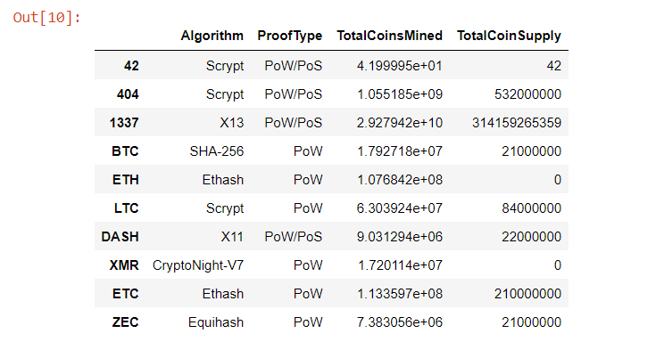
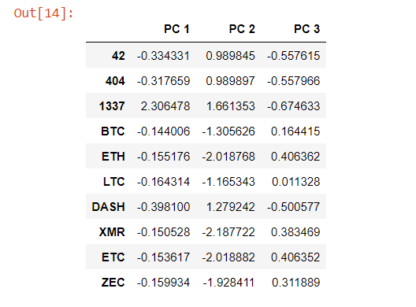
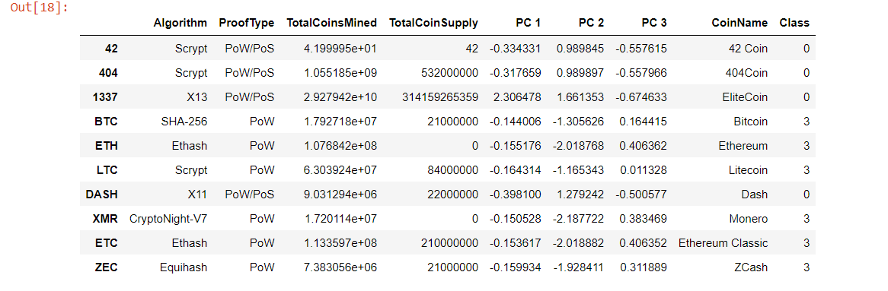
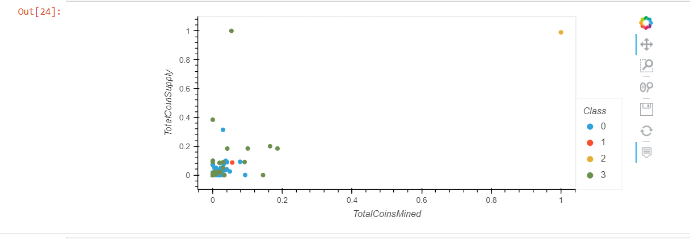

# Cryptocurrencies
 

## Overview:
 Since there is no known output for what Martha is looking for, an unsupervised learning was used. To group the cryptocurrencies, clustered algorithm was used and data visualization was used to share the findings.

 
## Results:

Deliverable 1: Preprocessing the Data for PCA

Deliverable 2: Reducing Data Dimensions Using PCA

Deliverable 3: Clustering Cryptocurrencies Using K-means

Deliverable 4: Visualizing Cryptocurrencies Results

